# 📋 Список тем CP-Roadmap

Здесь собран список тем, разделенный на 3 уровня сложности. Для каждой темы указаны:
- ✅ Наличие на **USACO Guide**
- 🎯 Рекомендуемый **рейтинг Codeforces** для изучения
- 🔗 **Пререквизиты** — что нужно знать перед этой темой

---

## 🗺️ Граф зависимостей

```mermaid
graph TD
    %% === ОНАЙ ===
    SORT["📶 Сортировка STL<br/>CF 800+"]
    BRUTE["🔄 Полный перебор<br/>CF 800+"]
    FREQ["📊 Частотные массивы<br/>CF 800+"]
    MOD["🔢 Модульная арифметика<br/>CF 1000+"]
    PREFIX["➕ Префиксные суммы<br/>CF 900+"]
    TWO_P["👆 Два указателя<br/>CF 1000+"]
    GREEDY["🤑 Базовая жадность<br/>CF 1000+"]
    BASIC_DP["🧠 Базовая динамика<br/>CF 1100+"]

    %% === СРЕДНИЙ ===
    BSEARCH["🔍 Бинарный поиск<br/>CF 1200+"]
    BSEARCH_ANS["🎯 Бинпоиск по ответу<br/>CF 1300+"]
    GCD["♻️ Евклид НОД/НОК<br/>CF 1200+"]
    SIEVE["🔬 Решето Эратосфена<br/>CF 1200+"]
    FASTPOW["⚡ Быстрое возведение<br/>CF 1300+"]
    DFS["🕸️ DFS<br/>CF 1300+"]
    BFS["🌊 BFS<br/>CF 1300+"]
    DIFF["📉 Разностный массив<br/>CF 1300+"]
    COMPRESS["📐 Сжатие координат<br/>CF 1400+"]
    HASH["#️⃣ Полином. хеширование<br/>CF 1400+"]
    MID_DP["💎 ДП: Рюкзак, НВП, НОП<br/>CF 1400+"]
    MODINV["🔄 Обратный по модулю<br/>CF 1500+"]

    %% === СЛОЖНЫЙ ===
    SEGTREE["🌲 Дерево отрезков<br/>CF 1600+"]
    BIT["🌿 Дерево Фенвика<br/>CF 1600+"]
    DSU["🔗 СНМ DSU<br/>CF 1500+"]
    DIJKSTRA["🛤️ Дейкстра<br/>CF 1600+"]
    LCA["👑 LCA<br/>CF 1800+"]
    SWEEP["📏 Сканирующая прямая<br/>CF 1600+"]
    TERNARY["🔺 Тернарный поиск<br/>CF 1600+"]
    TOPSORT["📋 Топ. сортировка<br/>CF 1500+"]
    MST["🌉 МОД Крускал/Прим<br/>CF 1600+"]
    KMP["🔤 КМП<br/>CF 1700+"]
    TRIE["🌳 Бор Trie<br/>CF 1700+"]
    BITMASK_DP["🎭 ДП по маскам<br/>CF 1700+"]
    TREE_DP["🌲 ДП на деревьях<br/>CF 1700+"]
    SPARSE["📊 Sparse Table<br/>CF 1700+"]

    %% === СВЯЗИ: ОНАЙ → СРЕДНИЙ ===
    SORT --> BSEARCH
    SORT --> GREEDY
    SORT --> TWO_P
    SORT --> PREFIX
    BRUTE --> BASIC_DP
    BRUTE --> DFS
    MOD --> GCD
    MOD --> FASTPOW
    PREFIX --> DIFF
    PREFIX --> BSEARCH_ANS
    BSEARCH --> BSEARCH_ANS
    BSEARCH --> COMPRESS
    GREEDY --> BSEARCH_ANS
    BASIC_DP --> MID_DP
    FREQ --> SIEVE
    MOD --> HASH
    FASTPOW --> MODINV

    %% === СВЯЗИ: СРЕДНИЙ → СЛОЖНЫЙ ===
    DFS --> TOPSORT
    DFS --> DSU
    DFS --> TREE_DP
    BFS --> DIJKSTRA
    GREEDY --> DIJKSTRA
    DSU --> MST
    GREEDY --> MST
    DFS --> LCA
    SPARSE --> LCA
    PREFIX --> SEGTREE
    PREFIX --> BIT
    BASIC_DP --> SEGTREE
    SORT --> SWEEP
    BSEARCH --> TERNARY
    MID_DP --> BITMASK_DP
    MID_DP --> TREE_DP
    HASH --> KMP
    DFS --> TRIE
    DIFF --> SEGTREE
    BIT --> SPARSE

    %% === СТИЛИ ===
    classDef easy fill:#22c55e,stroke:#16a34a,color:#fff
    classDef medium fill:#eab308,stroke:#ca8a04,color:#fff
    classDef hard fill:#ef4444,stroke:#dc2626,color:#fff

    class SORT,BRUTE,FREQ,MOD,PREFIX,TWO_P,GREEDY,BASIC_DP easy
    class BSEARCH,BSEARCH_ANS,GCD,SIEVE,FASTPOW,DFS,BFS,DIFF,COMPRESS,HASH,MID_DP,MODINV medium
    class SEGTREE,BIT,DSU,DIJKSTRA,LCA,SWEEP,TERNARY,TOPSORT,MST,KMP,TRIE,BITMASK_DP,TREE_DP,SPARSE hard
```

---

## 🟢 Онай (Легкий уровень)

| # | Тема | CF рейтинг | USACO Guide | Пререквизиты |
|---|------|-----------|-------------|---------------|
| 1 | 📶 Встроенная сортировка (STL) | **800+** | ✅ Bronze: Sorting | — нет, стартовая тема |
| 2 | 🔄 Полный перебор (Brute force) | **800+** | ✅ Bronze: Complete Search | — нет, стартовая тема |
| 3 | 📊 Частотные массивы | **800+** | ✅ Bronze/Silver | — нет, стартовая тема |
| 4 | ➕ Префиксные суммы | **900+** | ✅ Silver: Prefix Sums | Сортировка |
| 5 | 🤑 Базовая жадность | **1000+** | ✅ Bronze: Greedy | Сортировка |
| 6 | 👆 Два указателя | **1000+** | ✅ Silver: Two Pointers | Сортировка |
| 7 | 🔢 Модульная арифметика | **1000+** | ✅ Gold: Modular Arithmetic | — нет, стартовая тема |
| 8 | 🧠 Базовая динамика (Кузнечик) | **1100+** | ✅ Silver/Gold: Intro to DP | Полный перебор |

---

## 🟡 Средни (Средний уровень)

| # | Тема | CF рейтинг | USACO Guide | Пререквизиты |
|---|------|-----------|-------------|---------------|
| 9 | 🔍 Бинарный поиск | **1200+** | ✅ Silver: Binary Search | Сортировка |
| 10 | 🎯 Бинпоиск по ответу | **1300+** | ✅ Silver: BS on Answer | Бинарный поиск, Преф. суммы, Жадность |
| 11 | ♻️ Алгоритм Евклида (НОД/НОК) | **1200+** | ✅ Gold: Divisibility | Модульная арифметика |
| 12 | 🔬 Решето Эратосфена | **1200+** | ✅ Gold: Divisibility | Частотные массивы |
| 13 | ⚡ Быстрое возведение в степень | **1300+** | ✅ Gold: Modular Arithmetic | Модульная арифметика |
| 14 | 🕸️ DFS (Поиск в глубину) | **1300+** | ✅ Silver: Graph Traversal | Полный перебор |
| 15 | 🌊 BFS (Поиск в ширину) | **1300+** | ✅ Silver: Graph Traversal | DFS |
| 16 | 📉 Разностный массив | **1300+** | ✅ Silver: Difference Array | Префиксные суммы |
| 17 | 📐 Сжатие координат | **1400+** | ✅ Silver: Coordinate Compression | Сортировка, Бинарный поиск |
| 18 | #️⃣ Полиномиальное хеширование | **1400+** | ✅ Gold: String Hashing | Модульная арифметика |
| 19 | 💎 Динамика (Рюкзак, НВП, НОП) | **1400+** | ✅ Gold: Knapsack, etc. | Базовая динамика |
| 20 | 🔄 Обратный элемент по модулю | **1500+** | ✅ Gold: Modular Arithmetic | Быстрое возведение в степень |

---

## 🔴 Киын (Сложный уровень)

| # | Тема | CF рейтинг | USACO Guide | Пререквизиты |
|---|------|-----------|-------------|---------------|
| 21 | 🔗 СНМ (DSU) | **1500+** | ✅ Gold: DSU | DFS |
| 22 | 📋 Топологическая сортировка | **1500+** | ✅ Gold: Topological Sort | DFS |
| 23 | 🌲 Дерево отрезков | **1600+** | ✅ Gold/Platinum | Преф. суммы, Разн. массив, Базовая ДП |
| 24 | 🌿 Дерево Фенвика | **1600+** | ✅ Gold: Point Update Range Sum | Префиксные суммы |
| 25 | 🛤️ Алгоритм Дейкстры | **1600+** | ✅ Gold: Shortest Paths | BFS, Жадность |
| 26 | 📏 Сканирующая прямая | **1600+** | ✅ Silver/Gold: Line Sweep | Сортировка |
| 27 | 🔺 Тернарный поиск | **1600+** | ⚠️ Редко на USACO | Бинарный поиск |
| 28 | 🌉 МОД (Крускал/Прим) | **1600+** | ✅ Gold: MST | DSU, Жадность |
| 29 | 🔤 Префикс-функция (КМП) | **1700+** | ✅ Platinum: String Matching | Полином. хеширование |
| 30 | 🌳 Бор (Trie) | **1700+** | ✅ Platinum: Tries | DFS |
| 31 | 🎭 Динамика по маскам | **1700+** | ✅ Gold: Bitmask DP | ДП: Рюкзак, НВП, НОП |
| 32 | 🌲 Динамика на деревьях | **1700+** | ✅ Gold: DP on Trees | DFS, ДП: Рюкзак, НВП, НОП |
| 33 | 📊 Разреженная таблица (Sparse Table) | **1700+** | ✅ Platinum: Range Queries | Дерево Фенвика |
| 34 | 👑 LCA (Наименьший общий предок) | **1800+** | ✅ Platinum: Binary Jumping | DFS, Sparse Table |

---

## 📖 Как читать граф

- **Стрелка A → B** означает: чтобы учить тему B, нужно сначала знать тему A
- **🟢 Зелёный** = Онай (Лёгкий), начинай с этих тем
- **🟡 Жёлтый** = Средний, переходи сюда после зелёных
- **🔴 Красный** = Сложный, для продвинутых олимпиадников
- **CF рейтинг** = примерный рейтинг на Codeforces, при котором эта тема начинает встречаться в задачах
