```mermaid
graph TD
    STEPIK["🎓 Stepik: Основы C++"]

    STEPIK --> SORT
    STEPIK --> BRUTE
    STEPIK --> FREQ
    STEPIK --> MOD

    subgraph EASY["🟢 ОНАЙ"]
        direction LR
        PREFIX["Префиксные суммы"]
        TWO_P["Два указателя"]
        FREQ["Частотные массивы"]
        GREEDY["Базовая жадность"]
        MOD["Модульная арифметика"]
        SORT["Встроенная сортировка (STL)"]
        BASIC_DP["Базовая динамика (Кузнечик, лесенки)"]
        BRUTE["Полный перебор (Brute force)"]
    end

    subgraph MED["🟡 СРЕДНИ"]
        direction LR
        BSEARCH["Бинарный поиск"]
        BSEARCH_ANS["Бинпоиск по ответу"]
        GCD["Алгоритм Евклида (НОД/НОК)"]
        SIEVE["Решето Эратосфена"]
        FASTPOW["Быстрое возведение в степень"]
        DFS["DFS (Поиск в глубину)"]
        BFS["BFS (Поиск в ширину)"]
        DIFF["Разностный массив"]
        COMPRESS["Сжатие координат"]
        HASH["Полиномиальное хеширование"]
        MID_DP["Динамика (Рюкзак, НВП, НОП)"]
        MODINV["Обратный элемент по модулю"]
    end

    subgraph HARD["🔴 КИЫН"]
        direction LR
        SEGTREE["Дерево отрезков"]
        BIT_TREE["Дерево Фенвика"]
        DSU["СНМ (DSU)"]
        DIJKSTRA["Алгоритм Дейкстры"]
        LCA["LCA (Наименьший общий предок)"]
        SWEEP["Сканирующая прямая"]
        TERNARY["Тернарный поиск"]
        TOPSORT["Топологическая сортировка"]
        MST["Минимальное остовное дерево (Крускал/Прим)"]
        KMP["Префикс-функция (КМП)"]
        TRIE["Бор (Trie)"]
        BITMASK_DP["Динамика по маскам"]
        TREE_DP["Динамика на деревьях"]
        SPARSE["Разреженная таблица (Sparse Table)"]
    end

    SORT --> PREFIX
    SORT --> TWO_P
    SORT --> GREEDY
    BRUTE --> BASIC_DP

    SORT --> BSEARCH
    SORT --> SWEEP
    BRUTE --> DFS
    MOD --> GCD
    MOD --> FASTPOW
    MOD --> HASH
    FREQ --> SIEVE
    PREFIX --> DIFF
    PREFIX --> BSEARCH_ANS
    BSEARCH --> BSEARCH_ANS
    BSEARCH --> COMPRESS
    GREEDY --> BSEARCH_ANS
    BASIC_DP --> MID_DP
    FASTPOW --> MODINV
    DFS --> BFS

    DFS --> TOPSORT
    DFS --> DSU
    DFS --> TREE_DP
    DFS --> TRIE
    DFS --> LCA
    BFS --> DIJKSTRA
    GREEDY --> DIJKSTRA
    DSU --> MST
    GREEDY --> MST
    PREFIX --> SEGTREE
    PREFIX --> BIT_TREE
    DIFF --> SEGTREE
    BSEARCH --> TERNARY
    HASH --> KMP
    MID_DP --> BITMASK_DP
    MID_DP --> TREE_DP
    BIT_TREE --> SPARSE
    SPARSE --> LCA

    classDef start fill:#8b5cf6,stroke:#7c3aed,color:#fff,stroke-width:2px
    classDef easy fill:#22c55e,stroke:#16a34a,color:#fff,stroke-width:2px
    classDef medium fill:#f59e0b,stroke:#d97706,color:#fff,stroke-width:2px
    classDef hard fill:#ef4444,stroke:#dc2626,color:#fff,stroke-width:2px

    class STEPIK start
    class PREFIX,TWO_P,FREQ,GREEDY,MOD,SORT,BASIC_DP,BRUTE easy
    class BSEARCH,BSEARCH_ANS,GCD,SIEVE,FASTPOW,DFS,BFS,DIFF,COMPRESS,HASH,MID_DP,MODINV medium
    class SEGTREE,BIT_TREE,DSU,DIJKSTRA,LCA,SWEEP,TERNARY,TOPSORT,MST,KMP,TRIE,BITMASK_DP,TREE_DP,SPARSE hard
```

# 🏆 CP-Roadmap
### Навигатор по олимпиадному программированию

---

### 🚀 Важная инструкция для новичка:

> 1. 🎓 **Изучи основы C++:** Если ты только начинаешь и не знаешь синтаксис языка, сначала пройди бесплатный курс:  
>    👉 **[📚 Stepik — Программирование на C++](https://stepik.org/course/363/promo)**
>
> 2. ⚔️ **Решай задачи каждый день:** Обязательно решай по **3–4 задачи каждый день** на **[Codeforces](https://codeforces.com/)**.
>
> 3. 🎯 **Учи темы по своему рейтингу:** Когда твой рейтинг на Codeforces дойдет до соответствующей отметки (например, 1000+ или 1200+), открывай тему из списка ниже по прямой ссылке на **USACO Guide** и изучай её!

---

## 📋 Главное меню тем с ссылками на USACO Guide

### 🟢 Онай (Легкий уровень)

| # | Тема | Ссылка на USACO Guide | Когда учить (Рейтинг CF) |
|---|------|-----------------------|--------------------------|
| 1 | **Префиксные суммы** | 🔗 [USACO Guide: Prefix Sums](https://usaco.guide/silver/prefix-sums) | 🎯 **CF 900+** |
| 2 | **Два указателя** | 🔗 [USACO Guide: Two Pointers](https://usaco.guide/silver/two-pointers) | 🎯 **CF 1000+** |
| 3 | **Частотные массивы** | 🔗 [USACO Guide: Frequency Arrays](https://usaco.guide/silver/frequency-arrays) | 🎯 **CF 800+** |
| 4 | **Базовая жадность** | 🔗 [USACO Guide: Greedy Algorithms](https://usaco.guide/bronze/greedy) | 🎯 **CF 1000+** |
| 5 | **Модульная арифметика** | 🔗 [USACO Guide: Modular Arithmetic](https://usaco.guide/gold/modular) | 🎯 **CF 1000+** |
| 6 | **Встроенная сортировка (STL)** | 🔗 [USACO Guide: Sorting & Comparators](https://usaco.guide/silver/sorting-custom) | 🎯 **CF 800+** |
| 7 | **Базовая динамика (Кузнечик, лесенки)** | 🔗 [USACO Guide: Intro to DP](https://usaco.guide/gold/intro-dp) | 🎯 **CF 1100+** |
| 8 | **Полный перебор (Brute force)** | 🔗 [USACO Guide: Complete Search](https://usaco.guide/bronze/complete-search) | 🎯 **CF 800+** |

---

### 🟡 Средни (Средний уровень)

| # | Тема | Ссылка на USACO Guide | Когда учить (Рейтинг CF) |
|---|------|-----------------------|--------------------------|
| 9 | **Бинарный поиск** | 🔗 [USACO Guide: Binary Search](https://usaco.guide/silver/binary-search) | 🎯 **CF 1200+** |
| 10 | **Бинпоиск по ответу** | 🔗 [USACO Guide: Binary Search on Answer](https://usaco.guide/silver/binary-search) | 🎯 **CF 1300+** |
| 11 | **Алгоритм Евклида (НОД/НОК)** | 🔗 [USACO Guide: Divisibility & GCD](https://usaco.guide/gold/divisibility) | 🎯 **CF 1200+** |
| 12 | **Решето Эратосфена** | 🔗 [USACO Guide: Sieve of Eratosthenes](https://usaco.guide/gold/divisibility) | 🎯 **CF 1200+** |
| 13 | **Быстрое возведение в степень** | 🔗 [USACO Guide: Modular Exponentiation](https://usaco.guide/gold/modular) | 🎯 **CF 1300+** |
| 14 | **DFS (Поиск в глубину)** | 🔗 [USACO Guide: Depth First Search](https://usaco.guide/silver/dfs) | 🎯 **CF 1300+** |
| 15 | **BFS (Поиск в ширину)** | 🔗 [USACO Guide: Breadth First Search](https://usaco.guide/silver/bfs) | 🎯 **CF 1300+** |
| 16 | **Разностный массив** | 🔗 [USACO Guide: Difference Array](https://usaco.guide/silver/more-prefix-sums) | 🎯 **CF 1300+** |
| 17 | **Сжатие координат** | 🔗 [USACO Guide: Coordinate Compression](https://usaco.guide/silver/sorting-custom) | 🎯 **CF 1400+** |
| 18 | **Полиномиальное хеширование** | 🔗 [USACO Guide: String Hashing](https://usaco.guide/gold/string-hashing) | 🎯 **CF 1400+** |
| 19 | **Динамика (Рюкзак, НВП, НОП)** | 🔗 [USACO Guide: Knapsack & LIS DP](https://usaco.guide/gold/knapsack) | 🎯 **CF 1400+** |
| 20 | **Обратный элемент по модулю** | 🔗 [USACO Guide: Modular Inverse](https://usaco.guide/gold/modular) | 🎯 **CF 1500+** |

---

### 🔴 Киын (Сложный уровень)

| # | Тема | Ссылка на USACO Guide | Когда учить (Рейтинг CF) |
|---|------|-----------------------|--------------------------|
| 21 | **Дерево отрезков** | 🔗 [USACO Guide: Segment Tree](https://usaco.guide/plat/segtree) | 🎯 **CF 1600+** |
| 22 | **Дерево Фенвика** | 🔗 [USACO Guide: Binary Indexed Tree](https://usaco.guide/gold/purq) | 🎯 **CF 1600+** |
| 23 | **СНМ (DSU)** | 🔗 [USACO Guide: Disjoint Set Union](https://usaco.guide/gold/dsu) | 🎯 **CF 1500+** |
| 24 | **Алгоритм Дейкстры** | 🔗 [USACO Guide: Shortest Paths (Dijkstra)](https://usaco.guide/gold/shortest-paths) | 🎯 **CF 1600+** |
| 25 | **LCA (Наименьший общий предок)** | 🔗 [USACO Guide: Lowest Common Ancestor](https://usaco.guide/plat/binary-jump) | 🎯 **CF 1800+** |
| 26 | **Сканирующая прямая** | 🔗 [USACO Guide: Line Sweep](https://usaco.guide/plat/line-sweep) | 🎯 **CF 1600+** |
| 27 | **Тернарный поиск** | 🔗 [USACO Guide: Ternary Search](https://usaco.guide/general/ternary-search) | 🎯 **CF 1600+** |
| 28 | **Топологическая сортировка** | 🔗 [USACO Guide: Topological Sort](https://usaco.guide/gold/toposort) | 🎯 **CF 1500+** |
| 29 | **Минимальное остовное дерево (Крускал/Прим)** | 🔗 [USACO Guide: Minimum Spanning Trees](https://usaco.guide/gold/mst) | 🎯 **CF 1600+** |
| 30 | **Префикс-функция (КМП)** | 🔗 [USACO Guide: String Matching (KMP)](https://usaco.guide/plat/string-search) | 🎯 **CF 1700+** |
| 31 | **Бор (Trie)** | 🔗 [USACO Guide: Tries](https://usaco.guide/plat/trie) | 🎯 **CF 1700+** |
| 32 | **Динамика по маскам** | 🔗 [USACO Guide: Bitmask DP](https://usaco.guide/gold/bitmask-dp) | 🎯 **CF 1700+** |
| 33 | **Динамика на деревьях** | 🔗 [USACO Guide: DP on Trees](https://usaco.guide/gold/tree-dp) | 🎯 **CF 1700+** |
| 34 | **Разреженная таблица (Sparse Table)** | 🔗 [USACO Guide: Sparse Table](https://usaco.guide/plat/sparse-table) | 🎯 **CF 1700+** |

---

## 🗺️ Интерактивный граф зависимостей (Mermaid)

