# 🏆 CP-Roadmap
### Навигатор по олимпиадному программированию

> Дорожная карта для изучения спортивного программирования. Это НЕ базовый курс по синтаксису — это навигатор, который подскажет **какие алгоритмические темы учить**, **в каком порядке**, и **какие задачи решать**.

---

## 🎓 Не знаешь основ C++?

> Если ты только начинаешь и не знаешь синтаксис C++, сначала пройди бесплатный курс:
> **[📚 Stepik — Программирование на C++](https://stepik.org/course/363/promo)**
> 
> Когда освоишь переменные, циклы, массивы и функции — возвращайся сюда за алгоритмами!

---

## 🗺️ Граф зависимостей

```mermaid
graph TD
    %% ==============================
    %% СТАРТ — STEPIK
    %% ==============================
    STEPIK["🎓 Stepik: Основы C++\n━━━━━━━━━━━━━━━━\nПеременные, циклы,\nмассивы, функции"]

    STEPIK --> SORT
    STEPIK --> BRUTE
    STEPIK --> FREQ
    STEPIK --> MOD

    %% ==============================
    %% 🟢 ОНАЙ — ЛЕГКИЙ УРОВЕНЬ
    %% ==============================
    subgraph EASY["🟢 ОНАЙ — CF 800-1100"]
        direction LR
        SORT["📶 Сортировка STL\n◆ CF 800+"]
        BRUTE["🔄 Полный перебор\nбинарные строки, маски\n◆ CF 800+"]
        FREQ["📊 Частотные массивы\n◆ CF 800+"]
        MOD["🔢 Модульная арифметика\n◆ CF 1000+"]
        PREFIX["➕ Префиксные суммы\n◆ CF 900+"]
        TWO_P["👆 Два указателя\n◆ CF 1000+"]
        GREEDY["🤑 Базовая жадность\n◆ CF 1000+"]
        BASIC_DP["🧠 Базовая динамика\nкузнечик, лесенки\n◆ CF 1100+"]
    end

    %% ==============================
    %% 🟡 СРЕДНИЙ УРОВЕНЬ
    %% ==============================
    subgraph MED["🟡 СРЕДНИЙ — CF 1200-1500"]
        direction LR
        BSEARCH["🔍 Бинарный поиск\n◆ CF 1200+"]
        BSEARCH_ANS["🎯 Бинпоиск по ответу\n◆ CF 1300+"]
        GCD["♻️ Евклид НОД/НОК\n◆ CF 1200+"]
        SIEVE["🔬 Решето Эратосфена\n◆ CF 1200+"]
        FASTPOW["⚡ Быстрое возведение\nв степень\n◆ CF 1300+"]
        DFS["🕸️ DFS\nпоиск в глубину\n◆ CF 1300+"]
        BFS["🌊 BFS\nпоиск в ширину\n◆ CF 1300+"]
        DIFF["📉 Разностный массив\n◆ CF 1300+"]
        COMPRESS["📐 Сжатие координат\n◆ CF 1400+"]
        HASH["#️⃣ Полином. хеширование\n◆ CF 1400+"]
        MID_DP["💎 ДП: Рюкзак,\nНВП, НОП\n◆ CF 1400+"]
        MODINV["🔄 Обратный элемент\nпо модулю\n◆ CF 1500+"]
    end

    %% ==============================
    %% 🔴 СЛОЖНЫЙ УРОВЕНЬ
    %% ==============================
    subgraph HARD["🔴 КИЫН — CF 1500-1800+"]
        direction LR
        DSU["🔗 СНМ DSU\n◆ CF 1500+"]
        TOPSORT["📋 Топ. сортировка\n◆ CF 1500+"]
        SEGTREE["🌲 Дерево отрезков\n◆ CF 1600+"]
        BIT_TREE["🌿 Дерево Фенвика\n◆ CF 1600+"]
        DIJKSTRA["🛤️ Дейкстра\n◆ CF 1600+"]
        SWEEP["📏 Сканирующая прямая\n◆ CF 1600+"]
        TERNARY["🔺 Тернарный поиск\n◆ CF 1600+"]
        MST["🌉 МОД Крускал/Прим\n◆ CF 1600+"]
        KMP["🔤 КМП\nпрефикс-функция\n◆ CF 1700+"]
        TRIE["🌳 Бор Trie\n◆ CF 1700+"]
        BITMASK_DP["🎭 ДП по маскам\n◆ CF 1700+"]
        TREE_DP["🏔️ ДП на деревьях\n◆ CF 1700+"]
        SPARSE["📊 Sparse Table\n◆ CF 1700+"]
        LCA["👑 LCA\n◆ CF 1800+"]
    end

    %% ==============================
    %% СВЯЗИ: ОНАЙ внутри
    %% ==============================
    SORT --> PREFIX
    SORT --> TWO_P
    SORT --> GREEDY
    BRUTE --> BASIC_DP

    %% ==============================
    %% СВЯЗИ: ОНАЙ → СРЕДНИЙ
    %% ==============================
    SORT --> BSEARCH
    SORT --> SWEEP
    BRUTE --> DFS
    MOD --> GCD
    MOD --> FASTPOW
    MOD --> HASH
    FREQ --> SIEVE
    PREFIX --> DIFF
    PREFIX --> BSEARCH_ANS
    BSEARCH --> BSEARCH_ANS
    BSEARCH --> COMPRESS
    GREEDY --> BSEARCH_ANS
    BASIC_DP --> MID_DP
    FASTPOW --> MODINV
    DFS --> BFS

    %% ==============================
    %% СВЯЗИ: СРЕДНИЙ → СЛОЖНЫЙ
    %% ==============================
    DFS --> TOPSORT
    DFS --> DSU
    DFS --> TREE_DP
    DFS --> TRIE
    DFS --> LCA
    BFS --> DIJKSTRA
    GREEDY --> DIJKSTRA
    DSU --> MST
    GREEDY --> MST
    PREFIX --> SEGTREE
    PREFIX --> BIT_TREE
    DIFF --> SEGTREE
    BSEARCH --> TERNARY
    HASH --> KMP
    MID_DP --> BITMASK_DP
    MID_DP --> TREE_DP
    BIT_TREE --> SPARSE
    SPARSE --> LCA

    %% ==============================
    %% СТИЛИ
    %% ==============================
    classDef start fill:#8b5cf6,stroke:#7c3aed,color:#fff,stroke-width:3px
    classDef easy fill:#22c55e,stroke:#16a34a,color:#fff,stroke-width:2px
    classDef medium fill:#f59e0b,stroke:#d97706,color:#fff,stroke-width:2px
    classDef hard fill:#ef4444,stroke:#dc2626,color:#fff,stroke-width:2px

    class STEPIK start
    class SORT,BRUTE,FREQ,MOD,PREFIX,TWO_P,GREEDY,BASIC_DP easy
    class BSEARCH,BSEARCH_ANS,GCD,SIEVE,FASTPOW,DFS,BFS,DIFF,COMPRESS,HASH,MID_DP,MODINV medium
    class DSU,TOPSORT,SEGTREE,BIT_TREE,DIJKSTRA,SWEEP,TERNARY,MST,KMP,TRIE,BITMASK_DP,TREE_DP,SPARSE,LCA hard
```



---

## 📋 Полный список тем (34 темы)

### 🟢 Оңай (Легкий уровень) — CF 800-1100

| # | Тема | CF рейтинг | USACO Guide | Пререквизиты |
|---|------|-----------|-------------|---------------|
| 1 | 📶 Встроенная сортировка (STL) | **800+** | ✅ Bronze: Sorting | Stepik (основы C++) |
| 2 | 🔄 Полный перебор (бинарные строки, маски) | **800+** | ✅ Bronze: Complete Search | Stepik (основы C++) |
| 3 | 📊 Частотные массивы | **800+** | ✅ Bronze/Silver | Stepik (основы C++) |
| 4 | ➕ Префиксные суммы | **900+** | ✅ Silver: Prefix Sums | Сортировка |
| 5 | 🤑 Базовая жадность | **1000+** | ✅ Bronze: Greedy | Сортировка |
| 6 | 👆 Два указателя | **1000+** | ✅ Silver: Two Pointers | Сортировка |
| 7 | 🔢 Модульная арифметика | **1000+** | ✅ Gold: Modular Arithmetic | Stepik (основы C++) |
| 8 | 🧠 Базовая динамика (Кузнечик, лесенки) | **1100+** | ✅ Silver/Gold: Intro to DP | Полный перебор |

---

### 🟡 Средний уровень — CF 1200-1500

| # | Тема | CF рейтинг | USACO Guide | Пререквизиты |
|---|------|-----------|-------------|---------------|
| 9 | 🔍 Бинарный поиск | **1200+** | ✅ Silver: Binary Search | Сортировка |
| 10 | 🎯 Бинпоиск по ответу | **1300+** | ✅ Silver: BS on Answer | Бинарный поиск, Преф. суммы, Жадность |
| 11 | ♻️ Алгоритм Евклида (НОД/НОК) | **1200+** | ✅ Gold: Divisibility | Модульная арифметика |
| 12 | 🔬 Решето Эратосфена | **1200+** | ✅ Gold: Divisibility | Частотные массивы |
| 13 | ⚡ Быстрое возведение в степень | **1300+** | ✅ Gold: Modular Arithmetic | Модульная арифметика |
| 14 | 🕸️ DFS (Поиск в глубину) | **1300+** | ✅ Silver: Graph Traversal | Полный перебор |
| 15 | 🌊 BFS (Поиск в ширину) | **1300+** | ✅ Silver: Graph Traversal | DFS |
| 16 | 📉 Разностный массив | **1300+** | ✅ Silver: Difference Array | Префиксные суммы |
| 17 | 📐 Сжатие координат | **1400+** | ✅ Silver: Coordinate Compression | Сортировка, Бинарный поиск |
| 18 | #️⃣ Полиномиальное хеширование | **1400+** | ✅ Gold: String Hashing | Модульная арифметика |
| 19 | 💎 Динамика (Рюкзак, НВП, НОП) | **1400+** | ✅ Gold: Knapsack, etc. | Базовая динамика |
| 20 | 🔄 Обратный элемент по модулю | **1500+** | ✅ Gold: Modular Arithmetic | Быстрое возведение в степень |

---

### 🔴 Қиын (Сложный уровень) — CF 1500-1800+

| # | Тема | CF рейтинг | USACO Guide | Пререквизиты |
|---|------|-----------|-------------|---------------|
| 21 | 🔗 СНМ (DSU) | **1500+** | ✅ Gold: DSU | DFS |
| 22 | 📋 Топологическая сортировка | **1500+** | ✅ Gold: Topological Sort | DFS |
| 23 | 🌲 Дерево отрезков | **1600+** | ✅ Gold/Platinum | Преф. суммы, Разн. массив |
| 24 | 🌿 Дерево Фенвика | **1600+** | ✅ Gold: Point Update Range Sum | Префиксные суммы |
| 25 | 🛤️ Алгоритм Дейкстры | **1600+** | ✅ Gold: Shortest Paths | BFS, Жадность |
| 26 | 📏 Сканирующая прямая | **1600+** | ✅ Silver/Gold: Line Sweep | Сортировка |
| 27 | 🔺 Тернарный поиск | **1600+** | ⚠️ Редко на USACO | Бинарный поиск |
| 28 | 🌉 МОД (Крускал/Прим) | **1600+** | ✅ Gold: MST | DSU, Жадность |
| 29 | 🔤 Префикс-функция (КМП) | **1700+** | ✅ Platinum: String Matching | Полином. хеширование |
| 30 | 🌳 Бор (Trie) | **1700+** | ✅ Platinum: Tries | DFS |
| 31 | 🎭 Динамика по маскам | **1700+** | ✅ Gold: Bitmask DP | ДП: Рюкзак, НВП, НОП |
| 32 | 🏔️ Динамика на деревьях | **1700+** | ✅ Gold: DP on Trees | DFS, ДП: Рюкзак, НВП, НОП |
| 33 | 📊 Разреженная таблица (Sparse Table) | **1700+** | ✅ Platinum: Range Queries | Дерево Фенвика |
| 34 | 👑 LCA (Наименьший общий предок) | **1800+** | ✅ Platinum: Binary Jumping | DFS, Sparse Table |

---

## 📖 Как читать граф

```
🎓 Stepik ─────► Всё начинается отсюда. Сначала выучи основы C++.
    │
    ▼
🟢 ОНАЙ ───────► Первые алгоритмические темы. CF 800-1100.
    │
    ▼
🟡 СРЕДНИЙ ────► Классические алгоритмы. CF 1200-1500.
    │
    ▼
🔴 КИЫН ───────► Продвинутые структуры данных. CF 1500-1800+.
```

- **Стрелка A → B** означает: чтобы учить тему B, нужно сначала знать тему A
- **🟣 Фиолетовый** = Stepik (начало пути)
- **🟢 Зелёный** = Онай (Лёгкий, CF 800-1100)
- **🟡 Жёлтый** = Средний (CF 1200-1500)
- **🔴 Красный** = Киын (Сложный, CF 1500-1800+)
- **CF рейтинг** = примерный рейтинг на Codeforces, при котором эта тема начинает встречаться в задачах

---

## 📊 Диагностический контест

Стартовый контест для проверки начального уровня.

| # | Задача | Сложность | Ссылка |
|---|---|---|---|
| 1 | Watermelon | 800 | [Codeforces](https://codeforces.com/problemset/problem/4/A) |
| 2 | Team | 800 | [Codeforces](https://codeforces.com/problemset/problem/231/A) |
| 3 | Twins | 900 | [Codeforces](https://codeforces.com/problemset/problem/160/A) |
| 4 | Chat room | 1000 | [Codeforces](https://codeforces.com/problemset/problem/58/A) |
| 5 | Taxi | 1100 | [Codeforces](https://codeforces.com/problemset/problem/158/B) |
| 6 | Vanya and Lanterns | 1200 | [Codeforces](https://codeforces.com/problemset/problem/492/B) |
| 7 | Boredom | 1500 | [Codeforces](https://codeforces.com/problemset/problem/455/A) |
