# 🏆 CP-Roadmap
### Навигатор по олимпиадному программированию

Дорожная карта для изучения спортивного программирования. Навигатор по темам, уровню сложности и порядку их изучения.

---

## 🎓 Не знаешь основ C++?

> Если ты только начинаешь и не знаешь синтаксис C++, сначала пройди бесплатный курс:
> **[📚 Stepik — Программирование на C++](https://stepik.org/course/363/promo)**
>
> Когда освоишь переменные, циклы, массивы и функции — возвращайся сюда за алгоритмами!

---

## 📋 Список тем CP-Roadmap

### 🟢 Онай (Легкий уровень)

| # | Тема | USACO Guide | CF рейтинг |
|---|------|-------------|-----------|
| 1 | **Префиксные суммы** | ✅ Silver: Prefix Sums | 900+ |
| 2 | **Два указателя** | ✅ Silver: Two Pointers | 1000+ |
| 3 | **Частотные массивы** | ✅ Bronze/Silver: Frequency Arrays | 800+ |
| 4 | **Базовая жадность** | ✅ Bronze: Greedy Algorithms | 1000+ |
| 5 | **Модульная арифметика** | ✅ Gold: Modular Arithmetic | 1000+ |
| 6 | **Встроенная сортировка (STL)** | ✅ Bronze: Custom Comparators and Sorting | 800+ |
| 7 | **Базовая динамика (Кузнечик, лесенки)** | ✅ Silver/Gold: Intro to DP | 1100+ |
| 8 | **Полный перебор (Brute force)** | ✅ Bronze: Complete Search | 800+ |

---

### 🟡 Средни (Средний уровень)

| # | Тема | USACO Guide | CF рейтинг |
|---|------|-------------|-----------|
| 9 | **Бинарный поиск** | ✅ Silver: Binary Search | 1200+ |
| 10 | **Бинпоиск по ответу** | ✅ Silver: Binary Search on Answer | 1300+ |
| 11 | **Алгоритм Евклида (НОД/НОК)** | ✅ Gold: Divisibility & GCD | 1200+ |
| 12 | **Решето Эратосфена** | ✅ Gold: Divisibility & Sieve | 1200+ |
| 13 | **Быстрое возведение в степень** | ✅ Gold: Modular Exponentiation | 1300+ |
| 14 | **DFS (Поиск в глубину)** | ✅ Silver: Depth First Search | 1300+ |
| 15 | **BFS (Поиск в ширину)** | ✅ Silver: Breadth First Search | 1300+ |
| 16 | **Разностный массив** | ✅ Silver: Difference Arrays | 1300+ |
| 17 | **Сжатие координат** | ✅ Silver: Coordinate Compression | 1400+ |
| 18 | **Полиномиальное хеширование** | ✅ Gold: String Hashing | 1400+ |
| 19 | **Динамика (Рюкзак, НВП, НОП)** | ✅ Gold: Knapsack DP, LIS, LCS | 1400+ |
| 20 | **Обратный элемент по модулю** | ✅ Gold: Modular Inverse | 1500+ |

---

### 🔴 Киын (Сложный уровень)

| # | Тема | USACO Guide | CF рейтинг |
|---|------|-------------|-----------|
| 21 | **Дерево отрезков** | ✅ Gold/Platinum: Segment Tree | 1600+ |
| 22 | **Дерево Фенвика** | ✅ Gold: Binary Indexed Tree (Fenwick) | 1600+ |
| 23 | **СНМ (DSU)** | ✅ Gold: Disjoint Set Union | 1500+ |
| 24 | **Алгоритм Дейкстры** | ✅ Gold: Shortest Paths (Dijkstra) | 1600+ |
| 25 | **LCA (Наименьший общий предок)** | ✅ Platinum: Lowest Common Ancestor | 1800+ |
| 26 | **Сканирующая прямая** | ✅ Silver/Gold: Line Sweep | 1600+ |
| 27 | **Тернарный поиск** | ⚠️ Редко (в задачах Platinum) | 1600+ |
| 28 | **Топологическая сортировка** | ✅ Gold: Topological Sort | 1500+ |
| 29 | **Минимальное остовное дерево (Крускал/Прим)** | ✅ Gold: Minimum Spanning Trees | 1600+ |
| 30 | **Префикс-функция (КМП)** | ✅ Platinum: String Matching (KMP) | 1700+ |
| 31 | **Бор (Trie)** | ✅ Platinum: Tries | 1700+ |
| 32 | **Динамика по маскам** | ✅ Gold: Bitmask DP | 1700+ |
| 33 | **Динамика на деревьях** | ✅ Gold: DP on Trees | 1700+ |
| 34 | **Разреженная таблица (Sparse Table)** | ✅ Platinum: Sparse Table | 1700+ |

---

## 🗺️ Граф зависимостей

```mermaid
graph TD
    STEPIK["🎓 Stepik: Основы C++"]

    STEPIK --> SORT
    STEPIK --> BRUTE
    STEPIK --> FREQ
    STEPIK --> MOD

    subgraph EASY["🟢 ОНАЙ"]
        direction LR
        PREFIX["Префиксные суммы"]
        TWO_P["Два указателя"]
        FREQ["Частотные массивы"]
        GREEDY["Базовая жадность"]
        MOD["Модульная арифметика"]
        SORT["Встроенная сортировка (STL)"]
        BASIC_DP["Базовая динамика (Кузнечик, лесенки)"]
        BRUTE["Полный перебор (Brute force)"]
    end

    subgraph MED["🟡 СРЕДНИ"]
        direction LR
        BSEARCH["Бинарный поиск"]
        BSEARCH_ANS["Бинпоиск по ответу"]
        GCD["Алгоритм Евклида (НОД/НОК)"]
        SIEVE["Решето Эратосфена"]
        FASTPOW["Быстрое возведение в степень"]
        DFS["DFS (Поиск в глубину)"]
        BFS["BFS (Поиск в ширину)"]
        DIFF["Разностный массив"]
        COMPRESS["Сжатие координат"]
        HASH["Полиномиальное хеширование"]
        MID_DP["Динамика (Рюкзак, НВП, НОП)"]
        MODINV["Обратный элемент по модулю"]
    end

    subgraph HARD["🔴 КИЫН"]
        direction LR
        SEGTREE["Дерево отрезков"]
        BIT_TREE["Дерево Фенвика"]
        DSU["СНМ (DSU)"]
        DIJKSTRA["Алгоритм Дейкстры"]
        LCA["LCA (Наименьший общий предок)"]
        SWEEP["Сканирующая прямая"]
        TERNARY["Тернарный поиск"]
        TOPSORT["Топологическая сортировка"]
        MST["Минимальное остовное дерево (Крускал/Прим)"]
        KMP["Префикс-функция (КМП)"]
        TRIE["Бор (Trie)"]
        BITMASK_DP["Динамика по маскам"]
        TREE_DP["Динамика на деревьях"]
        SPARSE["Разреженная таблица (Sparse Table)"]
    end

    SORT --> PREFIX
    SORT --> TWO_P
    SORT --> GREEDY
    BRUTE --> BASIC_DP

    SORT --> BSEARCH
    SORT --> SWEEP
    BRUTE --> DFS
    MOD --> GCD
    MOD --> FASTPOW
    MOD --> HASH
    FREQ --> SIEVE
    PREFIX --> DIFF
    PREFIX --> BSEARCH_ANS
    BSEARCH --> BSEARCH_ANS
    BSEARCH --> COMPRESS
    GREEDY --> BSEARCH_ANS
    BASIC_DP --> MID_DP
    FASTPOW --> MODINV
    DFS --> BFS

    DFS --> TOPSORT
    DFS --> DSU
    DFS --> TREE_DP
    DFS --> TRIE
    DFS --> LCA
    BFS --> DIJKSTRA
    GREEDY --> DIJKSTRA
    DSU --> MST
    GREEDY --> MST
    PREFIX --> SEGTREE
    PREFIX --> BIT_TREE
    DIFF --> SEGTREE
    BSEARCH --> TERNARY
    HASH --> KMP
    MID_DP --> BITMASK_DP
    MID_DP --> TREE_DP
    BIT_TREE --> SPARSE
    SPARSE --> LCA

    classDef start fill:#8b5cf6,stroke:#7c3aed,color:#fff,stroke-width:2px
    classDef easy fill:#22c55e,stroke:#16a34a,color:#fff,stroke-width:2px
    classDef medium fill:#f59e0b,stroke:#d97706,color:#fff,stroke-width:2px
    classDef hard fill:#ef4444,stroke:#dc2626,color:#fff,stroke-width:2px

    class STEPIK start
    class PREFIX,TWO_P,FREQ,GREEDY,MOD,SORT,BASIC_DP,BRUTE easy
    class BSEARCH,BSEARCH_ANS,GCD,SIEVE,FASTPOW,DFS,BFS,DIFF,COMPRESS,HASH,MID_DP,MODINV medium
    class SEGTREE,BIT_TREE,DSU,DIJKSTRA,LCA,SWEEP,TERNARY,TOPSORT,MST,KMP,TRIE,BITMASK_DP,TREE_DP,SPARSE hard
```

